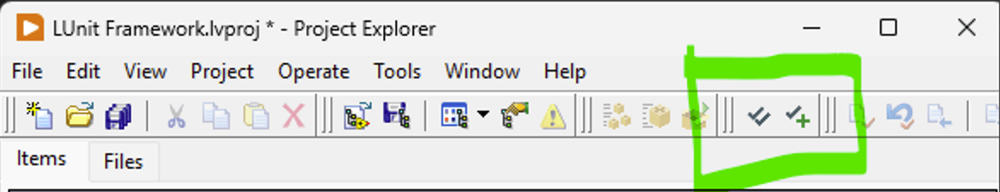
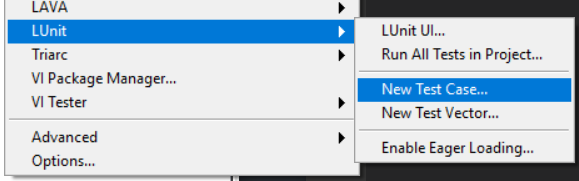
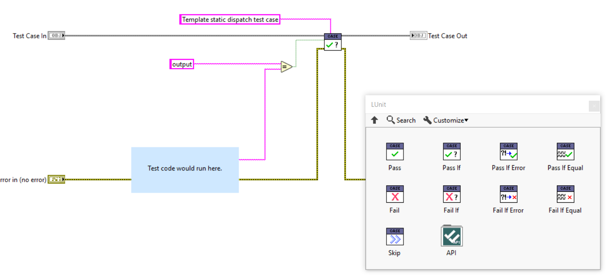
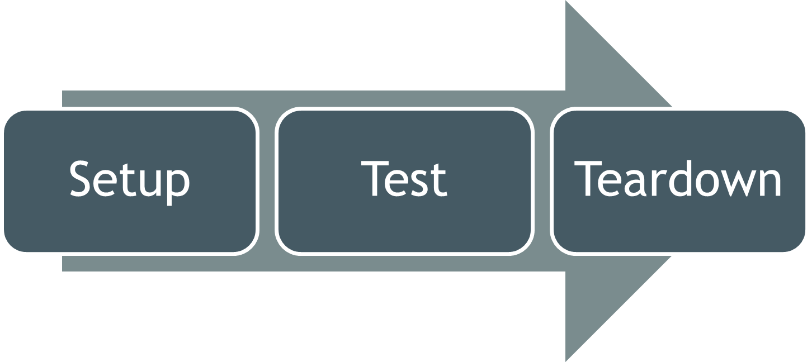
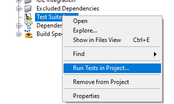
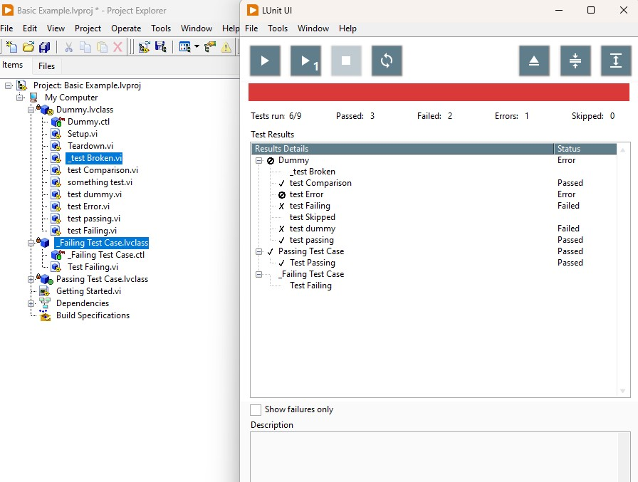

# LUnit Basics

This document walks through the basic workflow using LUnit to test LabVIEW code.
If you prefer to watch a video, there is an introduction available on [this link](https://www.youtube.com/watch?v=Cxb1FUIsC04).

## Prerequisites

To follow along with the instructions on this page you will need to have LabVIEW version 2020 or later installed as well as the LUnit unit testing framework.

## Creating a Test Case

All tests you write will belong to a test case.
The test case is implemented as a LabVIEW class, but in order to use it you will not need to know anything about object oriented programming.

To get started, create an empty project and add a test case to it by clicking the New Test Case button in the toolbar of the LabVIEW project.

You can also do the same from the ``Tools > LUnit > New Test Case...`` menu option.

Save the test case in a convenient location.
Some like to keep the tests next to the code they are testing, and other keep them in a separate folder called ``Tests`` or similar.
I personally find the later option with a separate top level directory the most convenient.

## Adding a Test Method

Now you have a test case and may add some test methods to the test case.
A test method is a vi belonging to the test case class and will get executed by the framework.

To create a new test method, right-click on the Test Static Test Method.vit and select ``New from Template``. **Important:** You need to save the test method using a name starting with the upper or lower case letters ``test``.

You can create test methods any way you like and you are free to delete the template methods if you choose to.
It is important however that the connector pane uses the same pattern of terminals as the template and that the name of the vi starts with the word ``test``.

You should now make your test method test something useful by implementing the block diagram of the vi.
To perform tests you will use the assertions available in the provided palette, or using quick drop.

## Using Assertions

The result of each test is determined using assertions.
There is a set of assertions to choose from, as shown in the figure above, and the names should be self explanatory.
One test method may contain multiple assertions and the result from each assertion will show up in the result view.

One pro-tip is that the ``Pass if Equal.vi`` assertion also works well for array data types.
The result of comparing arrays will show up in the result view as shown below.

Please note that the ``Pass if Equal.vi`` assertion will fail if either the type or the value does not match. 

## Running the Test Case

You can run a single test vi (using the Run Arrow) and it will run and show the user interface with the results of the test.

To run all tests contained in a test case, you can right click it in the project window and select the ``Run Test Case...`` menu option.

This will open the test execution user interface and run the test case.
Alternatively you can also launch the user interface from the tools menu through the ``Tools > LUnit > LUnit UI...`` menu option.
This will open the user interface and show all tests in the current project.
As the test is run, the results are also shown as visual icons overlays in the project explorer.

## Using the Setup and Teardown methods

You can add a Setup and a Teardown method to the test case by overriding the corresponding dynamic dispatch vi:s.
The Setup vi will run once before each test method in the test case and the Teardown will run once after the test method is completed.
This is useful in some cases, but should not be overused as it makes the test methods less verbose.
If you need to pass data from the Setup vi to the test method vi or Teardown vi, you can bundle the data into the test case class wire.

## Organizing Tests

It does make sense to organize tests in some manner, especially as the number of tests increase.
There are many common practices around where to keep tests and how to organize the folder structure on disk. 
In general it is useful to keep tests separated from the source, as there should be no dependency from the source on the test code.

While developing, it is convenient to keep the tests within the active LabVIEW project, as they may then be run quickly through the [project integration](#running-the-test-case) and you can run all the tests in the project through the tools menu option.
As test suites grow, it becomes less convenient as the test time accumulates with larger test suites and some of the tests might not be relevant to the feature under development.
While it is important to run the whole suite to catch regression issues, this does not have to be done as frequently as tests covering the new feature.

A good workflow is to keep a separate LabVIEW project file as a test suite where all tests are collected.
Tests may be moved from the active project into this test suite and the test suite may then be added to the active LabVIEW project as a project item. 
All tests within the test suite project may then be executed using the right clikc menu option, but will not be executed when running all tests in current project from the tools menu option and will not need to be loaded with the project.

When executing tests in a Continuous Integration environment, this test suite LabVIEW project file is a good entry point for running tests.

In LUnit version 1.3.1, an additional feature was introduced to help speeding up test execution by skipping slow or unrelated tests.
A test method (`vi`) or entire test case class (`lvclass`) may be marked with an underscore `_` character as the first character, making it into a `dashed` test class or test case.
`Dashed` tests may be skipped when running through the user interface by using the menu option `Ignore Dashed Tests` as shown below.

Notice that the test "_test Broken.vi" and the entire "_test Failing Test Case.lvclass" were not executed during the test run in the previous image.
By toggling the `Ignore Dashed Tests` menu option, it is straight forward to optimize test execution for either execution speed or test coverage.
In a typical test driven development workflow, test execution speed must be very fast as the tests are executed repeatedly on time scale of minutes.
It is however important to catch regressions by regularly running the full test suite, including the dashed tests.
When running LUnit using the API, as would be the case on a Continuous Integration server, dashed tests are never skipped.