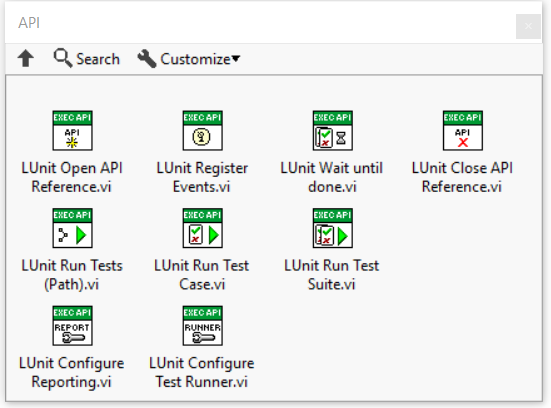

# Framework Architecture

The LUnit unit testing framework is derived from the xUnit architecture.
This page briefly introduces the main concepts.

## Test Case

A Test Case is the base class containing all test methods which are included in the test case.
The Test Case class defines two dynamic dispatch test methods called Setup.vi and Teardown.vi.
These methods are executed before and after each test method in the test case.

## Test Methods

A test method is a VI belonging to a class inheriting from the Test Case class.
The test method name must start with the letters `test` in either upper or lower case.
The conector pane of the test case must use the 4-2-2-4 pattern and have the standard connectors for static or dynamic dispatch methods.

## Static and Dynamic Test Methods

A Test Method may be implemented as either a dynamic or static dispatch vi, just like for any LabVIEW class.
The concept is slightly overloaded by the LUnit framework to allow for minimal code duplication when testing class hierarchies.

A static test method will only be executed for the test case in which it has been defined.

A dynamic test method will be executed for the test case where it is defined and for any test case inheriting from the test case defining it.
For this to make sense, a dynamic dispatch test method will need some kind of mechanism for knowing the context which it runs within, *i.e.* what to test.
A pattern used for this is illustrated in the example called `Test Inheritance`.
In this pattern the class under test is configured by setting the class under test in the Setup.vi method.

## Assertions

Tests are evaluated by one or more assertions called in the test method.
The assertions are available from the LUnit palette and the quick drop menu.

## Test Runner

A test runner is a process executing all mehtods within a Test Case and collecting the results.
LUnit supports spawning multiple parallell Test Runners, which can significantly reduce the test time for large test suites.
Test runners may run in separate threads and can leverage a multicore processor to run tests concurrently.

## Test Finder

When launching the LUnit UI, the test runner searches for classes inheriting from the base Test Class within the current application instance.
The result is saved into an index file and retrieved on subsequent runs to only search through classes which have changed since last time.
To force the test finder to recreate the index, use the refresh test index button in the LUnit UI.

## LabVIEW API

An API is provided for executing tests programatically from LabVIEW.
Tests are executed using the provided methods and results are returned using User Events, which may be registered for using the provided API method.
The use of the API is illustrated in the `LUnit API Demo` example.
The API is accessed from the API subpalette of the LUnit palette.

## Command Line Interface

LUnit exposes a command line interface (CLI) to [enable execution from continuous integration tools](../30_CI%20Integration/CI%20Integration.md).
LUnit adds an operation to the LabVIEWCLI when installed.
Please note that LUnit must be installed for the version of LabVIEW called from the CLI.

## Test Vectors

The test vector is a test case which implements a test vector in the same format as the NI Unit Test Framework.
The feature is to be regarded as experimental.