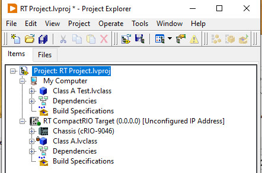
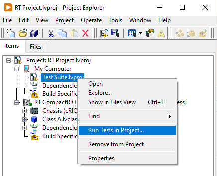

# Real-Time Systems

A good rule of thumb is to only write tests for the code which you want to work.
Thus, code running on a real time system does in general qualify for testing.
And it is particularly useful to test the code outside production as debugging and troubleshooting a real-time target can be very painful.

## Testing with hardware

Any kind of input/output (IO) is problematic when writing test code. 
In LabVIEW we typically have IO in the form of user interfaces, hardware drivers, and possibly some databases and files.
When running tests on code coupled to IO of some sort, it is in general worth separating the code at the boundaries to test the IO communication separtely from the rest of the application.
There are many reasons for this including:

- Testing with hardware requires you to have the hardware setup in order to run the tests. This might not be convenient or even feasible in many cases.
- Including hardware, and the configuration of it, adds a large chunk of complexity as there are more things that can fail.
- Hardware communication adds significant overhead to the test time.
- If the hardware is hidden behind an abstraction, it may easily be replaced. 
- Replacing hardware IO with a test double ensures determinism when running the tests.
- Testing that the driver works does not add much value in an automated test environment.

How to use test doubles to avoid testing with real world IO is an interesting topic, but beyond the scope of this document. 

## About running tests on a Real-Time target

While it is very important to test the code on actual hardware, it does not make sense in most cases to run unit tests on a real-time target. 
To do so would slow down test execution and requires access to the target during development.
There are some differences and peculiarities to keep in mind when executing code in an RT environemnt, *e.g.* file paths and unsupported features, but apart from that the code should work the same as under Windows.

## Working with tests in LabVIEW Real-Time

It is somewhat more tedious to work with tests for code on a LabVIEW Real-Time target compared to vanilla LabVIEW.
One reason for this is that libraries gets locked when opened in multiple application instances, and this would happen frequently when developing code on an RT target and testing under Windows.
Additionally the code needs to be recompiled  for the different targets.

A naive approach would be to keep the test case under the target and run it as normal using the UI.

This works in principle, but LabVIEW will recompile the code for each test execution and is for this reason rather slow.
This recompilation can be avoided by moving the test case to the My Computer target.

This speeds up the loading of the test as compilation is avoided, but it comes at the cost of locking the class under test.
The lock occurs because the test case depends on the class under test, which is then loaded into two separate application instances.

To solve this we can create a new project file to contain the tests and add this to our main project as a project item. 

As the project file is treated as a text file, it will not load anything into memory when added to the project.
This implies that the class under test will not be locked unless the test suite is also in memory.
The test suite may then be run from the right click menu and tests will not need to be recompiled on subsequent test executions.
There will however be a smaller overhead from loading the project into memory when running the tests.

## Running LUnit on a Real-Time target

There is nothing preventing LUnit from running in a Real-Time environment.
However, the Test Execution UI will not be able to run on the target as it uses front panel events not available under LabVIEW Real-Time. 
Instead the LUnit LabVIEW API should be used to execute tests and collect results when the tests must run on the Real-Time target.
