# Test Documentation in MD

## Project description

No description found (add content in project description)

## Classes

This section describes the classes contained in the project.

### Classes overview

This project contains 7 classes and 0 interface.

Classes list

| Classes | Interfaces |
|:---|:---|
| [Assertion Result.lvclass](#assertion-resultlvclass) |  |
| [Method Result.lvclass](#method-resultlvclass) |  |
| [Test Case Result.lvclass](#test-case-resultlvclass) |  |
| [Test Suite Result.lvclass](#test-suite-resultlvclass) |  |
| [Execution API.lvclass](#execution-apilvclass) |  |
| [LUnit Test Case.lvclass](#lunit-test-caselvclass) |  |
| [LUnit Test Suite.lvclass](#lunit-test-suitelvclass) |  |

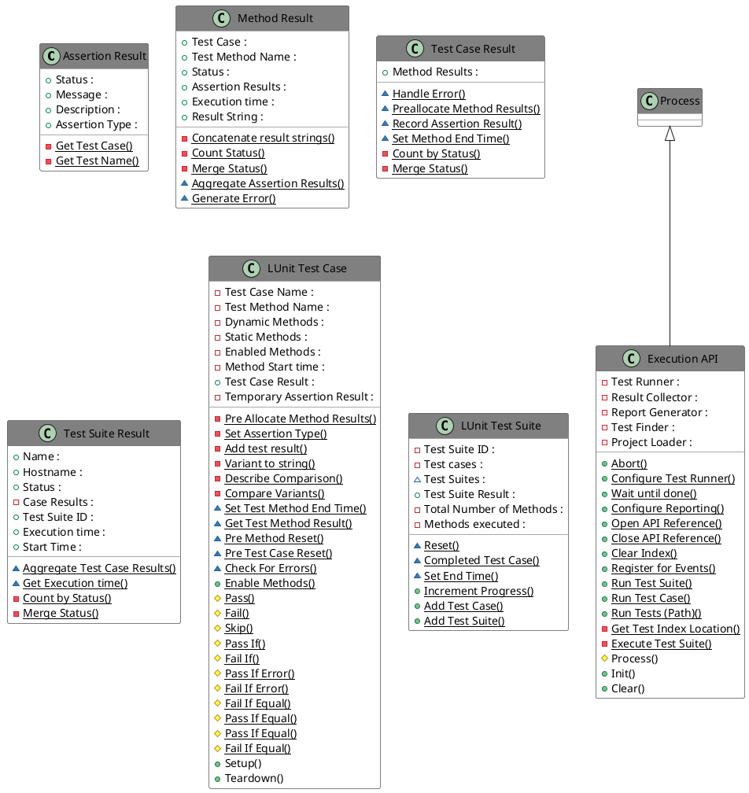

### Assertion Result.lvclass

*Responsibility:*
No description found (add content in lvclass description)

*Version:* 1.0.0.5

```plantuml format="svg"
  @startuml
  set namespaceSeparator :
  skinparam ClassBackgroundColor #FFFFFF
  skinparam ClassBorderColor #555555
  skinparam ClassFontColor #000000
  skinparam ClassHeaderBackgroundColor #808080
  
  skinparam top to bottom direction
  class "Assertion Result" {
  {field} +Status : 
  {field} +Message : 
  {field} +Description : 
  {field} +Assertion Type : 
  {static} {method} -Get Test Case()
  {static} {method} -Get Test Name()
  
  }
  
  
  
  @enduml
```

Functions (non private scope only)

| 
Name
 | 
Connector pane
 | 
Description
 | 
S.
 | 
R.
 | 
I.
 |
|:---|:---|:---|:---|:---|:---|
| Write Assertion Type |  | `only writes type if it is not already set upstreams`  |  |  |  |
| Write Description |  | No description found (add content in vi description) |  |  |  |
| Write Message | 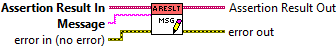 | No description found (add content in vi description) |  |  |  |
| Write Passed | 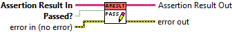 | No description found (add content in vi description) |  |  |  |
| Write Skipped |  | No description found (add content in vi description) |  |  |  |
| Read Assertion Type | 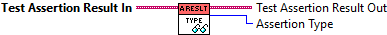 | No description found (add content in vi description) |  |  |  |
| Read Description |  | No description found (add content in vi description) |  |  |  |
| Read Message |  | No description found (add content in vi description) |  |  |  |
| Read Status |  | No description found (add content in vi description) |  |  |  |

**S**cope:  -> Protected |  -> Community

**R**eentrancy:  -> Preallocated reentrancy |  -> Shared reentrancy

**I**nlining:  -> Inlined

### Method Result.lvclass

*Responsibility:*
No description found (add content in lvclass description)

*Version:* 1.0.0.10

```plantuml format="svg"
  @startuml
  set namespaceSeparator :
  skinparam ClassBackgroundColor #FFFFFF
  skinparam ClassBorderColor #555555
  skinparam ClassFontColor #000000
  skinparam ClassHeaderBackgroundColor #808080
  
  skinparam top to bottom direction
  class "Method Result" {
  {field} +Test Case : 
  {field} +Test Method Name : 
  {field} +Status : 
  {field} +Assertion Results : 
  {field} +Execution time : 
  {field} +Result String : 
  {static} {method} -Concatenate result strings()
  {static} {method} -Count Status()
  {static} {method} -Merge Status()
  {static} {method} ~Aggregate Assertion Results()
  {static} {method} ~Generate Error()
  
  }
  
  
  
  @enduml
```

Functions (non private scope only)

| 
Name
 | 
Connector pane
 | 
Description
 | 
S.
 | 
R.
 | 
I.
 |
|:---|:---|:---|:---|:---|:---|
| Aggregate Assertion Results |  | No description found (add content in vi description) |  |  |  |
| Generate Error |  | No description found (add content in vi description) |  |  |  |
| Write Execution time |  | No description found (add content in vi description) |  |  |  |
| Write Test Case |  | No description found (add content in vi description) |  |  |  |
| Write Test Method Name | 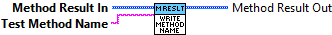 | No description found (add content in vi description) |  |  |  |
| Read Assertion Results |  | No description found (add content in vi description) |  |  |  |
| Read Assertions count |  | No description found (add content in vi description) |  |  |  |
| Read Error Count | 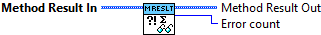 | No description found (add content in vi description) |  |  |  |
| Read Execution time | 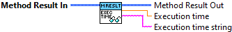 | No description found (add content in vi description) |  |  |  |
| Read Failed Count | 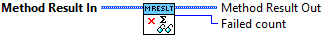 | No description found (add content in vi description) |  |  |  |
| Read Passed Count |  | No description found (add content in vi description) |  |  |  |
| Read Result String |  | No description found (add content in vi description) |  |  |  |
| Read Skipped Count | 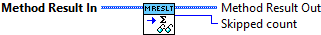 | No description found (add content in vi description) |  |  |  |
| Read Status |  | No description found (add content in vi description) |  |  |  |
| Read Test Case |  | No description found (add content in vi description) |  |  |  |
| Read Test Method Name | 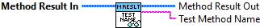 | No description found (add content in vi description) |  |  |  |

**S**cope:  -> Protected |  -> Community

**R**eentrancy:  -> Preallocated reentrancy |  -> Shared reentrancy

**I**nlining:  -> Inlined

### Test Case Result.lvclass

*Responsibility:*
No description found (add content in lvclass description)

*Version:* 1.0.0.6

```plantuml format="svg"
  @startuml
  set namespaceSeparator :
  skinparam ClassBackgroundColor #FFFFFF
  skinparam ClassBorderColor #555555
  skinparam ClassFontColor #000000
  skinparam ClassHeaderBackgroundColor #808080
  
  skinparam top to bottom direction
  class "Test Case Result" {
  {field} +Method Results : 
  {static} {method} ~Handle Error()
  {static} {method} ~Preallocate Method Results()
  {static} {method} ~Record Assertion Result()
  {static} {method} ~Set Method End Time()
  {static} {method} -Count by Status()
  {static} {method} -Merge Status()
  
  }
  
  
  
  @enduml
```

Functions (non private scope only)

| 
Name
 | 
Connector pane
 | 
Description
 | 
S.
 | 
R.
 | 
I.
 |
|:---|:---|:---|:---|:---|:---|
| Handle Error |  | No description found (add content in vi description) |  |  |  |
| Preallocate Method Results |  | No description found (add content in vi description) |  |  |  |
| Record Assertion Result | 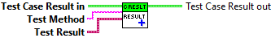 | No description found (add content in vi description) |  |  |  |
| Set Method End Time |  | No description found (add content in vi description) |  |  |  |
| Read Error Count | 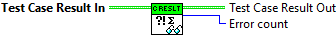 | No description found (add content in vi description) |  |  |  |
| Read Execution time | 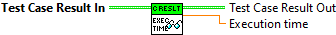 | No description found (add content in vi description) |  |  |  |
| Read Failed Count | 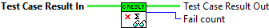 | No description found (add content in vi description) |  |  |  |
| Read Method Results |  | No description found (add content in vi description) |  |  |  |
| Read Passed Count | 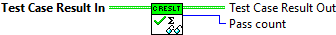 | No description found (add content in vi description) |  |  |  |
| Read Skipped Count |  | No description found (add content in vi description) |  |  |  |
| Read Status |  | No description found (add content in vi description) |  |  |  |
| Read Test Case |  | No description found (add content in vi description) |  |  |  |
| Read Test Method Count |  | No description found (add content in vi description) |  |  |  |

**S**cope:  -> Protected |  -> Community

**R**eentrancy:  -> Preallocated reentrancy |  -> Shared reentrancy

**I**nlining:  -> Inlined

### Test Suite Result.lvclass

*Responsibility:*
No description found (add content in lvclass description)

*Version:* 1.0.0.5

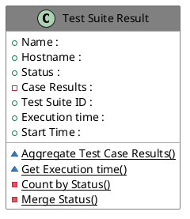

Functions (non private scope only)

| 
Name
 | 
Connector pane
 | 
Description
 | 
S.
 | 
R.
 | 
I.
 |
|:---|:---|:---|:---|:---|:---|
| Aggregate Test Case Results |  | No description found (add content in vi description) |  |  |  |
| Write Test Suite ID |  | No description found (add content in vi description) |  |  |  |
| Write Time Stamp |  | No description found (add content in vi description) |  |  |  |
| Get Execution time |  | No description found (add content in vi description) |  |  |  |
| Read Disabled count | 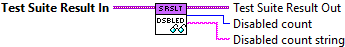 | No description found (add content in vi description) |  |  |  |
| Read Errors count |  | No description found (add content in vi description) |  |  |  |
| Read Execution time |  | No description found (add content in vi description) |  |  |  |
| Read Failed count |  | No description found (add content in vi description) |  |  |  |
| Read Hostname |  | No description found (add content in vi description) |  |  |  |
| Read Name | 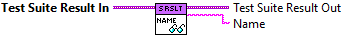 | No description found (add content in vi description) |  |  |  |
| Read Passed count | 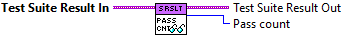 | No description found (add content in vi description) |  |  |  |
| Read Skipped count |  | No description found (add content in vi description) |  |  |  |
| Read Start Time |  | No description found (add content in vi description) |  |  |  |
| Read Status |  | No description found (add content in vi description) |  |  |  |
| Read Test Case count | 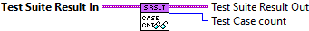 | No description found (add content in vi description) |  |  |  |
| Read Test Case Results | 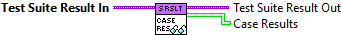 | No description found (add content in vi description) |  |  |  |
| Read Test Method Count |  | No description found (add content in vi description) |  |  |  |
| Read Test Suite ID |  | No description found (add content in vi description) |  |  |  |

**S**cope:  -> Protected |  -> Community

**R**eentrancy:  -> Preallocated reentrancy |  -> Shared reentrancy

**I**nlining:  -> Inlined

### Execution API.lvclass

*Responsibility:*
No description found (add content in lvclass description)

*Version:* 1.0.0.12

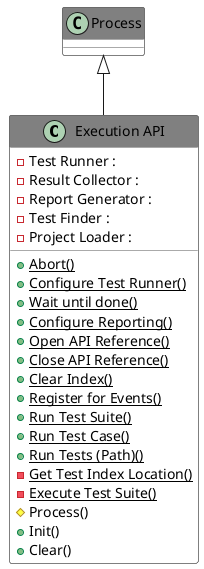

Functions (non private scope only)

| 
Name
 | 
Connector pane
 | 
Description
 | 
S.
 | 
R.
 | 
I.
 |
|:---|:---|:---|:---|:---|:---|
| Abort |  | `Aborts a running execution.`  |  |  |  |
| Configure Test Runner |  | `Configure the number of test runners to launch in parallell. The configuration must be made before running the tests.`  |  |  |  |
| Wait until done |  | `Waits until all tests have been executed. The Result Events is obrained from the Register for Events.vi`  |  |  |  |
| Configure Reporting | 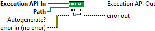 | `Configure reporting path and toggle automatic report generation.`  |  |  |  |
| Open API Reference |  | `Initializes the API and obtains a reference. The reference should be closed using the Close API Reference.vi when it is no longer needed.`  |  |  |  |
| Close API Reference | 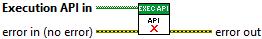 | `Closes the API reference. Please note that any Event Registrations obtained from hte Register for Events.vi will need to be unregistered for.`  |  |  |  |
| Clear Index | 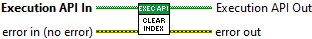 | `Clear the index forcing it to be recreated when running tests.`  |  |  |  |
| Register for Events | 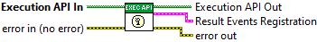 | `Obtain an event registration which can be used to observe the execution while running and obtain results.`  |  |  |  |
| Run Test Suite |  | `Run all tests in a Test Suite.`  |  |  |  |
| Run Test Case | 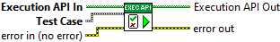 | `Run a single test case.`  |  |  |  |
| Run Tests (Path) | .vi.png) | `Run all tests in a project or a test case at the specified path.`  |  |  |  |
| Process |  | No description found (add content in vi description) |  |  |  |
| Init | 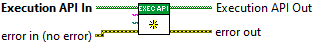 | `Initializes the process and creates necessary references. Anything initialized here is released in the Clear.vi method.`  |  |  |  |
| Clear |  | `Clears any resorces allocated during initialization.`  |  |  |  |

**S**cope:  -> Protected |  -> Community

**R**eentrancy:  -> Preallocated reentrancy |  -> Shared reentrancy

**I**nlining:  -> Inlined

### LUnit Test Case.lvclass

*Responsibility:*
No description found (add content in lvclass description)

*Version:* 1.0.0.12

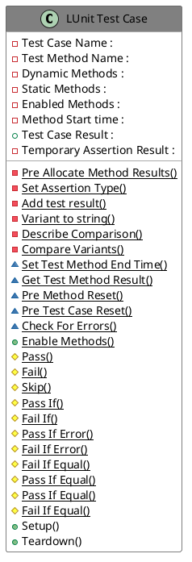

Functions (non private scope only)

| 
Name
 | 
Connector pane
 | 
Description
 | 
S.
 | 
R.
 | 
I.
 |
|:---|:---|:---|:---|:---|:---|
| Set Test Method End Time |  | No description found (add content in vi description) |  |  |  |
| Get Test Method Result |  | No description found (add content in vi description) |  |  |  |
| Pre Method Reset | 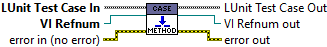 | No description found (add content in vi description) |  |  |  |
| Pre Test Case Reset | 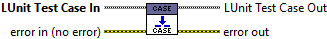 | No description found (add content in vi description) |  |  |  |
| Check For Errors |  | No description found (add content in vi description) |  |  |  |
| Read Enabled Test Methods |  | No description found (add content in vi description) |  |  |  |
| Write Static Test Methods |  | No description found (add content in vi description) |  |  |  |
| Write Dynamic Test Methods | 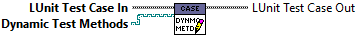 | No description found (add content in vi description) |  |  |  |
| Enable Methods | 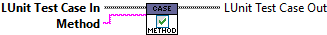 | No description found (add content in vi description) |  |  |  |
| Read Test Case Result |  | No description found (add content in vi description) |  |  |  |
| Pass | 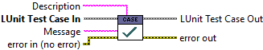 | `Generates a pass result for the calling test method. A description and message may be provided.`  |  |  |  |
| Fail |  | `Generates a fail result for the calling test method. A description and message may be provided.`  |  |  |  |
| Skip | 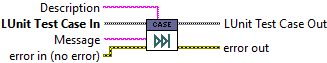 | `Ignores results from the calling test method when evaluating the test case result. A description and message may be provided.`  |  |  |  |
| Pass If | 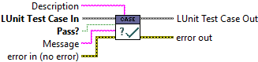 | `Generates a pass result for the calling test method if the conditional input is true. A description and message may be provided.`  |  |  |  |
| Fail If |  | `Generates a fail result for the calling test method if the conditional input is true. A description and message may be provided.`  |  |  |  |
| Pass If Error |  | `Generates a pass result for the calling test method if the inputs contains an error with status "True". A description may be provided to the result.`  |  |  |  |
| Fail If Error | 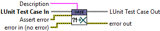 | `Generates a fail result for the calling test method if the inputs contains an error with status "True". A description may be provided to the result.`  |  |  |  |
| Fail If Equal |  | `Generates a fail result for the calling test method if the inputs are equal. For numeric inputs, a tolerance range may be specified using the Delta input. A description may be provided to the result.`  |  |  |  |
| Pass If Equal |  | `Generates a pass result for the calling test method if the inputs are equal. For numeric inputs, a tolerance range may be specified using the Delta input. A description may be provided to the result.`  |  |  |  |
| Pass If Equal | 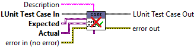 | `***DEPRECATED*** Use the maleable (.vim) version of this VI instead. `  `Generates a pass result for the calling test method if the inputs are equal. For numeric inputs, a tolerance range may be specified using the Delta input. A description may be provided to the result.`  |  |  |  |
| Fail If Equal |  | `***DEPRECATED*** Use the maleable (.vim) version of this VI instead. `  `Generates a fail result for the calling test method if the inputs are equal. For numeric inputs, a tolerance range may be specified using the Delta input. A description may be provided to the result.`  |  |  |  |
| Setup |  | `Setup method called by the testing framework before each test method is called.`  |  |  |  |
| Teardown | 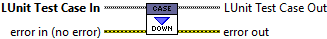 | No description found (add content in vi description) |  |  |  |

**S**cope:  -> Protected |  -> Community

**R**eentrancy:  -> Preallocated reentrancy |  -> Shared reentrancy

**I**nlining:  -> Inlined

### LUnit Test Suite.lvclass

*Responsibility:*
No description found (add content in lvclass description)

*Version:* 1.0.0.8

```plantuml format="svg"
  @startuml
  set namespaceSeparator :
  skinparam ClassBackgroundColor #FFFFFF
  skinparam ClassBorderColor #555555
  skinparam ClassFontColor #000000
  skinparam ClassHeaderBackgroundColor #808080
  
  skinparam top to bottom direction
  class "LUnit Test Suite" {
  {field} -Test Suite ID : 
  {field} -Test cases : 
  {field} ~Test Suites : 
  {field} +Test Suite Result : 
  {field} -Total Number of Methods : 
  {field} -Methods executed : 
  {static} {method} ~Reset()
  {static} {method} ~Completed Test Case()
  {static} {method} ~Set End Time()
  {static} {method} +Increment Progress()
  {static} {method} +Add Test Case()
  {static} {method} +Add Test Suite()
  
  }
  
  
  
  @enduml
```

Functions (non private scope only)

| 
Name
 | 
Connector pane
 | 
Description
 | 
S.
 | 
R.
 | 
I.
 |
|:---|:---|:---|:---|:---|:---|
| Read Test Suites |  | `Get all nested Test Suites.`  |  |  |  |
| Reset | 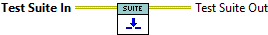 | `Resets results and current test case.`  |  |  |  |
| Completed Test Case | 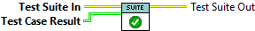 | `Generate test case rusults and increment current test.`  |  |  |  |
| Set End Time | 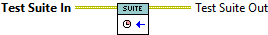 | `Generate test suite results. `  |  |  |  |
| Read Test Cases |  | `Get next test case to execute.`  |  |  |  |
| Read Test Suite Result |  | `Read Test Suite Result. The Generate Test Suite vi needs to have been called before getting the result.`  |  |  |  |
| Increment Progress | 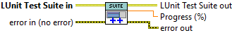 | No description found (add content in vi description) |  |  |  |
| Add Test Case |  | No description found (add content in vi description) |  |  |  |
| Add Test Suite | 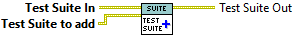 | No description found (add content in vi description) |  |  |  |

**S**cope:  -> Protected |  -> Community

**R**eentrancy:  -> Preallocated reentrancy |  -> Shared reentrancy

**I**nlining:  -> Inlined
